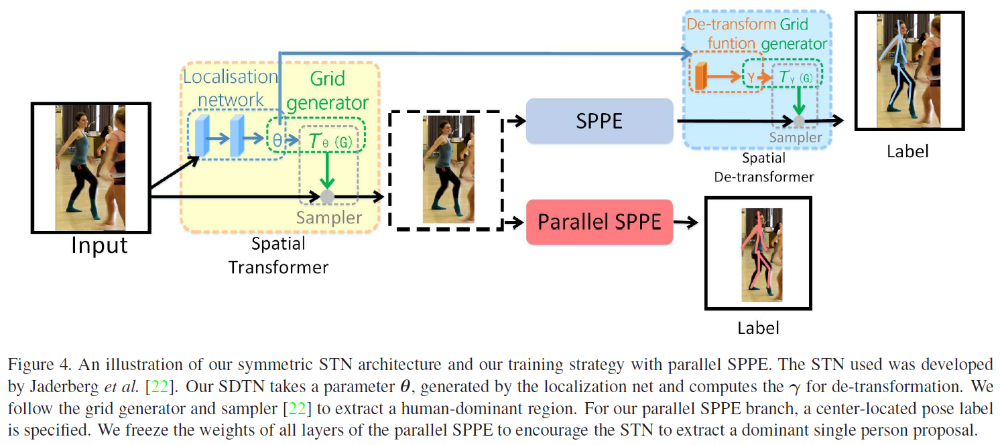
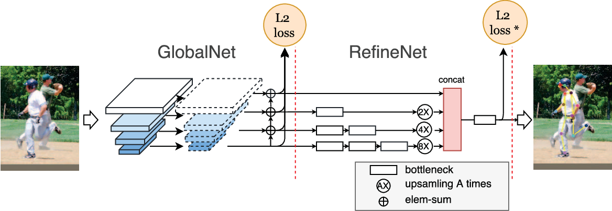
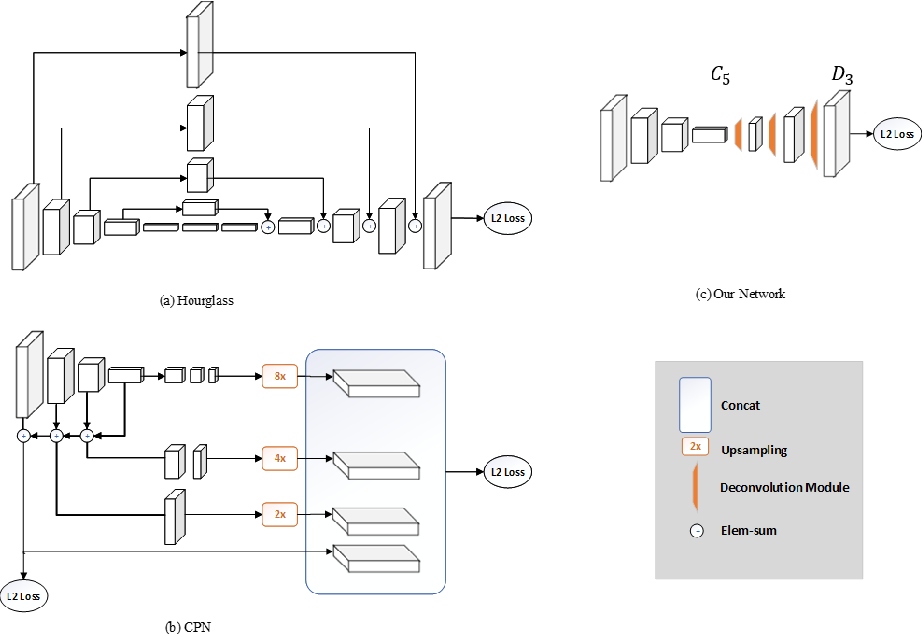

Recent Models on Pose Estimation
===

1. References
    - Pose Estimation: [https://paperswithcode.com/task/pose-estimation](https://paperswithcode.com/task/pose-estimation)
    - Multi-Person Pose Estimation: [https://paperswithcode.com/task/multi-person-pose-estimation](https://paperswithcode.com/task/multi-person-pose-estimation)
    - Keypoint Detection: [https://paperswithcode.com/task/keypoint-detection](https://paperswithcode.com/task/keypoint-detection)

2. Recently published, but no codes (as 21, Nov, 2019)
    - Cascade Feature Aggregation (2019)
    - DarkPose (2019, repository exsists but not ready)
    - Spacial Contextual Information (2019)

3. To understand pose estimation models, we need to know sub tasks of pose estimation. Mostly these are mixed, but some of models focused on specific task.
    - Single / Multi person pose estimation
    - Keypoint detection (COCO Keypoint Detection Challenge)
    - Pose tracking (PoseTrack Challenge)
    - Refinement pose estimation
	
4. In pose estimation pipe lines, there is two approaches. 
    1. Top-Down Approaches(two-step framework): firstly locate and crop all persons from images, and then solve the single person pose estimation problem in the cropped person patches.
    2. Bottom-Up Approaches(part-based framework): directly predict all keypoints at first and assemble them into full poses of all persons.

RMPE (2016)
---
**"RMPE: Regional Multi-person Pose Estimation"**

[[Paper Link]](https://arxiv.org/abs/1612.00137v5)
[[Code Link]](https://github.com/MVIG-SJTU/AlphaPose) * Code link is connected to AlphaPose that is new version of RMPE.

Ref: [STN (Spatial Transformer Network)](https://jamiekang.github.io/2017/05/27/spatial-transformer-networks/)

 

- SPPE: Single Person Pose Estimator
- SSTN(STN+SDTN): Symmetric Spatial Transformer Network
- p-Pose NMS: Parametric Pose Non-Maximum-Suppression
- PGPG: Pose-Guided Proposals Generator

 

RMPE는 기본적으로 human detector를 통해 region proposal을 수행한 뒤, 각각의 region에서 SPPE를 적용해 pose를 추출해내는 two-step framework 이다. human detector와 SPPE는 기존의 다양한 방법들을 사용할 수 있고, 실제 테스트로 faster-rcnn (human detector)과 stacked hourglass model (SPPE)를 사용하였다.

RMPE는 human detector가 올바르지 못한 region을 제안하더라도 pose estimation 하기에 무리가 없도록 하는 것을 목표로 한다.
잘못된 region으로부터 localization error와 redundant detection problem이 발생하는데, 이를 SSTN과 p-Pose NMS를 통해 극복하였다. 

SSTN은 STN과 SDTN(Spatial De-Transformer Network)으로 구성되며, SPPE의 전후에 추가된다. 
STN은 이미지 속 객체를 transform 시켜 객체를 효과적으로 파악할 수 있도록 해준다 (STN 링크 참고).
STN은 human detector로부터 region을 입력받게 되는데, 해당 영역에서 사람을 이미지 가운데 위치시키도록 훈련시킨다 (STN을 훈련할땐 Parallel SPPE를 이용). 이는 SPPE가 더 효과적으로 사람객체를 파악할 수 있도록 해준다. 

STN의 transform 결과는 사람의 위치, 회전, 크기를 변형시킨 것이다. 따라서 STN의 결과를 SPPE에 전달하여 포즈를 계산한 뒤, 다시 포즈가 원본 영역에서 제대로된 위치를 찾도록 SDTN을 수행한다. 
결과적으로 SSTN은 SPPE가 human detector로부터 제안된 영역에서 포즈 추정을 할때 최대의 성능을 끌어내도록 돕는 역할을 한다.

Cascaded Pyramid Network(CPN+) (2017)
---
**"Cascaded Pyramid Network for Multi-Person Pose Estimation"**

[[Paper Link]](https://arxiv.org/abs/1711.07319v2)
[[Code Link]](https://github.com/chenyilun95/tf-cpn)

Ref: [[ResNet]](http://openresearch.ai/t/resnet-deep-residual-learning-for-image-recognition/41) [[RoIAlign of Mask R-CNN]](https://cdm98.tistory.com/33) [[FPN]](https://eehoeskrap.tistory.com/300) 

- simple keypoints: eyes, hands that easly recognizable
- hard keypoints: occluded and invisible keypoints, complex background

 

CPN은 simple keypoints를 찾는 것뿐만이 아니라 hard keypoints 문제까지도 해결하고자 하였다. CPN은 two stages 구조로 접근하여 GlobalNet과 RefineNet으로 구성된다. 
GlobalNet은 feature pyramid net(FPN)을 기반으로 하여 simple keypoints를 찾는다. 
RefineNet은 GlobalNet으로부터 모든 레벨의 feature representations을 통합함으로써 hard keypoints를 다룬다. 

CPN의 GlobalNet 네트워크 구조는 ResNet backbone에 기반한다. ResNet의 conv features conv2~5의 마지막 residual blocks에 대해 3x3 컨볼루션 필터를 적용하여 heatmap을 생성한다. 이러한 heatmap들의 spatial resolution과 semantic information은 서로 대립적인 관계가 성립됨을 주목해, 이를 둘다 유지하기 위한 FPN의 U-shape 구조를 사용한다.

그러나 GlobalNet 단일 네트워크로는 hard keypoints를 탐지하기에 부족하므로, RefineNet으로 upsampling과 concatenating을 하여 레벨 간 정보를 통합시킨다 (HyperNet 방식). 

Deconvolution Head Network(가제) (2018)
---
**"Simple Baselines for Human Pose Estimation and Tracking"**

[[Paper Link]](https://arxiv.org/abs/1804.06208v2)
[[Code Link]](https://github.com/Microsoft/human-pose-estimation.pytorch)

Ref: [[Deconvolution]](https://dambaekday.tistory.com/3) [[Batch Normalization]](https://light-tree.tistory.com/139)

 

이 모델은 이전의 복잡한 모델들(Hourglass, CPN, etc) 보다 상당히 간단한 구조로 약간 더 높은 정확도를 보여 주목을 받게 되었다. 연구의 방향은 '복잡한 것과 반대로 간단한 구조가 얼마나 좋은 성능을 보일수 있는가'를 나타내는 것에 목적을 두고 있다. 

DHN은 ResNet을 기반으로, ResNet의 마지막 컨볼루션 stage에 deconvolutional layers를 추가하였다. 3개의 deconvolutional layer와 batch normalization 그리고 ReLU가 사용된다. 각 레이어는 4x4 커널을 가진 256 필터를 사용한다. 마지막은 k개의 keypoint를 나타내는 heatmaps을 생성하기 위해 1x1 convolutional layer가 사용된다. 

기존의 모델들과의 중요한 차이점은 high resolution feature map을 생성하기 위해 upsampling, put convolutional parameters 를 따로 사용하지 않고, 이 두 방법을 skip layer connection 없이 deconvolutional layer로 통합시킨다.

HRNet (2019)
---
**"Deep High-Resolution Representation Learning for Human Pose Estimation"**

[[Paper Link]](https://arxiv.org/abs/1902.09212v1)
[[Code Link]](https://github.com/leoxiaobin/deep-high-resolution-net.pytorch)

