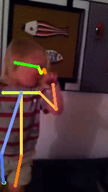

**아래 gif 영상들은 저하된 화질로 나타납니다.**

Datasets
===

 <b>SSBD</b> 

SSBD
---

SSBD 데이터셋은 3가지 종류의 행동 (Arm flapping, Headbanging, Spinning)을 보이는 유튜브 영상들로 이루어져 있다. 유튜브 사용자들이 공개한 영상들이기 때문에 SSBD에서 제공하는 일부 영상들은 비공개되거나 삭제되어 사용할 수 없다. 또한, 다운받을 수 있는 영상들 중에도 상태가 좋지 않은 영상들 (서로 다른 resolution, 심한 노이즈, 어두움, 정지된 영상, 끊김 등)이 있다는 것을 감안한다.

실험을 위해 다음과 같은 과정을 수행하였다.
  1. 데이터셋이 제공하는 annotation 파일(`.xml`)을 기준으로, 각 원본 영상에서 (e.g. v_ArmFlapping_01.avi) 두드러진 Action이 관찰된 구간만 참조한다.
  2. 참조한 구간을 [오픈소스 툴](https://github.com/antran89/clipping_ssbd_videos)을 사용해 ???x320 size의 영상으로 추출한다.

ArmFlapping | HeadBanging | Spinning
:--------:|:--------:|:--------:
 |  | 

 

 <b>Infant Normative Dataset</b> 

Infant Normative Dataset
---

생후 20주차 이내의 건강한 아이들의 움직임을 녹화한 유튜브 영상들 (100개 이상)로 구성되어 있다. 영상들은 대체로 양호하지만, 촬영할 때의 각도나 영상 속 아이의 머리가 향한 방향이 조금씩 다르다 (e.g. 오른쪽 방향으로 누워있는 아이, 위쪽 방향으로 누워 있는 아이).

실험을 위해 다음과 같은 과정을 수행하였다.
  1. 데이터셋이 제공하는 annotation 파일(`.csv`)을 기준으로, 각 원본 영상에서 (e.g. 4.avi) 아이의 모습만 촬영된 구간을 참조한다.
  2. 참조한 구간을 MoviePy를 사용해 ???x320 size의 영상으로 추출한다.

example 1 | example 2
:--------:|:--------:
 | 

 

---

Experiments
===

사용한 모델
- [OpenPose](https://github.com/prasunroy/openpose-pytorch) (pytorch version)
- [AlphaPose](https://github.com/aFewThings/AlphaPose/blob/master/docs/MODEL_ZOO.md) (backbone: HRNet-W32, detector: YOLOv3)
- infant normative dataset에 적용시킨 [transfer learning openpose](https://github.com/cchamber/Infant_movement_assessment#2-extract-pose-from-videos)

Comparison
---

 <b>SSBD</b> 

### SSBD

- ArmFlapping

OpenPose | AlphaPose
:--------:|:--------:
 | 
 | 

- HeadBanging

OpenPose | AlphaPose
:--------:|:--------:
 | 
 | 

- Spinning

OpenPose | AlphaPose
:--------:|:--------:
 | 
 | 

 <b>Infant Normative Dataset</b> 

### Infant Normative Dataset

- 머리가 오른쪽/왼쪽 방향으로 향한 자세

OpenPose | AlphaPose | transfer_learning_openpose
:--------:|:--------:|:--------:
 |  | 
 |  | 

- 머리가 위쪽 방향으로 향한 자세

OpenPose | AlphaPose | transfer_learning_openpose
:--------:|:--------:|:--------:
 |  | 
 |  | 

- 새우잠 자세 / 특이한 자세

OpenPose | AlphaPose | transfer_learning_openpose
:--------:|:--------:|:--------:
 |  | 
 |  | 

- 엎드린 자세

OpenPose | AlphaPose | transfer_learning_openpose
:--------:|:--------:|:--------:
 |  | 
 |  | 

- 역동적인 움직임

OpenPose | AlphaPose | transfer_learning_openpose
:--------:|:--------:|:--------:
 |  | 
 |  | 

