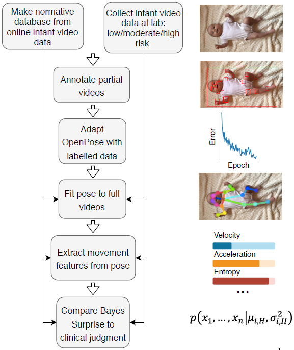

## Infant-related Computer Vision Papers

---

### Infant Pose Estimation / Movement Analysis

#### On the Estimation of Children’s Poses (2017)

- The aim of this research is to verify whether the performance of state of the art methods on the dataset (toddlers and children images) are comparable to those obtained on the benchmark datasets containing mainly images of adults. 
- They have collected and annotated a dataset images containing children extracted from videos recorded in an uncontrolled environment and available on public domain websites and video portals. 
  - Total 1176 images related to 104 different subjects
- They have compared four well known methods (RNN, CPM, MPP, IEF) on dataset. 
- Experiments point out that accuracy drops down for all methods when estimating poses of children and toddlers.

#### Computer vision to automatically assess infant neuromotor risk (2020)

- An infant’s risk of developing neuromotor impairment is primarily assessed through visual examination by specialized clinicians. There is a need to develop automated, clinical assessments based on quantitative measures from widely-available sources, such as videos recorded on a mobile device.
- **They have developed a framework to identify infants at risk of neuromotor disorder based on video data**. The approach was to compare infants assessed in the laboratory at different levels of neuromotor risk with a **normative dataset of infant movement** extracted from online videos.
  - **Using pose estimation model** (**OpenPose** trained from the normative dataset of infant movement), they extracted kinematic features from videos. They found that **the naïve Bayesian Surprise measure** of risk varies across participant groups.
  - They examined the main latent variables that describe the data, with the finding that velocity and acceleration distinguish infants from the reference population with at-risk infants, and that high-risk infants differ from reference in their posture, postural variability, and symmetry. Combinations of movement features are predictive of neuromotor risk.

#### Invariant Representation Learning for Infant Pose Estimation with Small Data (2020)

- **Models trained on large-scale adult pose datasets are barely successful in estimating infant poses** due to the significant differences in their body ratio and the versatility of poses they can take compared to adults. Moreover, the privacy and security considerations hinder the availability of adequate infant images required for training of a robust pose inference model from scratch.
- They focused on a **critical small data problem** of infant pose estimation.
- They proposed **fine-tuned domain-adapted infant pose (FiDIP) estimation network** which is a data-efficient inference model **based on both transfer learning and synthetic data augmentation approaches.**
  - FiDIP consists of two sub-networks (**pose estimation network** and **domain confusion network**)
  - They start with a pre-trained pose estimation network trained on adult pose data (i.e. source domain) and then fine-tune the network with both synthetic and real infant pose data (i.e. target domain)
  - To tackle the domain shift issue between real and synthetic infant pose images, a domain confusion network is embedded into pose estimation network to adapt the synthetic and real pose data in a feature level.
  - Both domain confusion network and pose estimation network are updated separately in iterative way.

---

### Action Recognition / Classification

#### Video Gesture Analysis for Autism Spectrum Disorder Detection (2018)

- The underlying idea and rationale come from the psychological and neuroscience studies claiming that the executions of simple motor acts are different between pathological and healthy subjects, and this can be sufficient to discriminate between them.
- This work aims at providing an automatic objective support to the doctor for the assessment of (early) diagnosis of possible autistic subjects by only using video sequences. 
- They have proposed a **novel dataset of simple grasping gestures (placing, pouring, pass-to-place, pass-to-pour) labeled according to ASD/TD subject** who performed the action and to the different underlying intention. 
- They designed an **LSTM model with an attentional mechanism**, and demonstrated that it is able to classify whether a grasping act is performed by ASD or TD subjects with a robust performance.