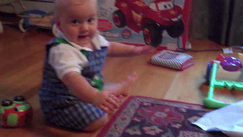
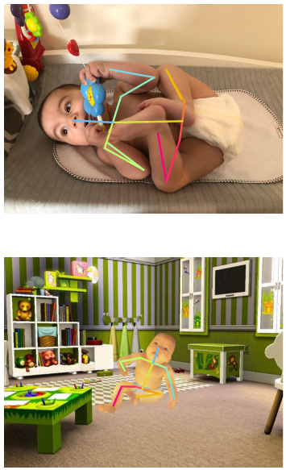

## Infant-related Datasets

---

### Action Label

#### Self-Stimulatory Behaviours in the Wild for Autism Diagnosis Dataset (SSBD)

[https://rolandgoecke.net/research/datasets/ssbd/](https://rolandgoecke.net/research/datasets/ssbd/)

[https://github.com/antran89/clipping_ssbd_videos](https://github.com/antran89/clipping_ssbd_videos)

- extremely challenging (low quality, occulusion, etc) for analysis as they are recorded in uncontrolled natural settings.
- 75 URLs of videos with average duration of 90 sec.
- action label with 3 groups (arm flapping, head banging, spinning)
- XML annotation format.

---

### RGB, RGB-D / Synthetic Data

#### Infant Movement-Based Assessments (Normative Database of Infant Movements)

[https://github.com/cchamber/Infant_movement_assessment](https://github.com/cchamber/Infant_movement_assessment)

They focused automated tests.

This dataset contains as followed:

- System to extract pose estimates from video. (pose_extraction.zip)
- Zip file with 'data' and 'models' folders to add to code repository (infant_movement_assessment_repo_files.zip)
- Meta-data of YouTube videos in normative database of healthy infant movement (meta_data_youtube_dataset.csv)
- Meta-data of at-risk infant videos recorded in laboratory (meta_data_clinical_dataset.csv)
- Raw pose estimates from YouTube videos included in normative database of healthy infant movement (pose_estimates_youtube_dataset.csv)
- Raw pose estimates from videos recorded in laboratory (pose_estimates_clinical_dataset.csv)
- URLs of YouTube videos used to adapt pose-estimation algorithm (URL_labelled_dataset.csv)
- URLs of YouTube videos used for normative database of healthy infant movement (URL_pose_dataset.csv)
- Search terms used to find infant videos on YouTube for adapting OpenPose and to include in the normative database of healthy infant movement (search_terms.txt)
- Visualization of kinematic features
- Supplemental table describing infants tested in the laboratory

#### The Moving Infants In RGB-D dataset (MINI-RGBD)

[https://www.iosb.fraunhofer.de/servlet/is/82920/](https://www.iosb.fraunhofer.de/servlet/is/82920/)

MINI-RGBD dataset is focused on generating infant 2D/3D pose dataset without privacy problems. To preserve the privacy of infants, they generated new textures and shapes by averaging multiple texture and shapes of real infants using [SMIL](https://www.youtube.com/watch?v=aahF1xGurmM&feature=youtu.be) (Multi-Infant Linear body model).

- 2D and 3D ground truths (skeletons)
- infants up to the age of 7 months
- continuous motions instead of single frames
- RGB, depth images

#### Synthetic and Real Infant Pose (SyRIP)

[https://github.com/ostadabbas/Infant-Pose-Estimation](https://github.com/ostadabbas/Infant-Pose-Estimation)

They publicly released a synthetic and real infant pose (SyRIP) dataset with small yet diverse real infant images as well as generated synthetic infant data. SyRIP dataset includes a training part consists of 200 real and 1000 synthetic infant images, and a test part with 500 real infant images, all with fully annotated body joints.

- real and synthetic infant (newborn to one year old) images
- training set (200 real, 1000 synthetic)
- test set (500 real)
- annotated 17 keypoints in COCO fashion

#### Autism Spectrum Disorder Detection Dataset

[https://github.com/pmorerio/video-gesture-autism](https://github.com/pmorerio/video-gesture-autism)

They proposed autism spectrum disorder detection dataset consisting in a set of video clips of reach-to-grasp actions performed by children with Autism Spectrum Disorders (ASD) and IQ-matched typically developing (TD) children. Children of the two groups were asked to grasp a bottle, in order to perform four different subsequent actions (placing, pouring, passing to pour, and passing to place). They attempt to classify whether actions are performed by a TD or an ASD child, by only processing the part of video data recording the grasping gesture. The only exploitable information is conveyed by the kinematics, being the surrounding context totally uninformative. 

- 20 children with ASD, 20 children with TD
- 1280 x 720 resolution videos
- trimmed data (The video sequences are exactly trimmed at the instant when the hand grasps the bottle, removing the following part.)
- 1837 video sequences with 83 frames averagely
